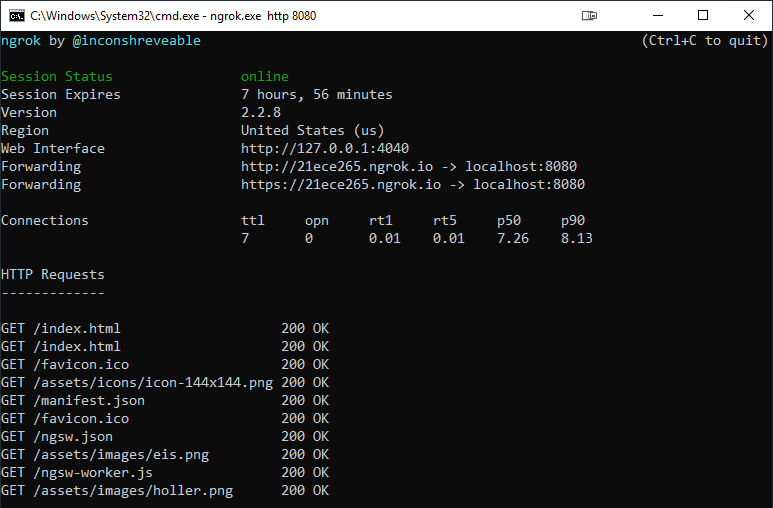
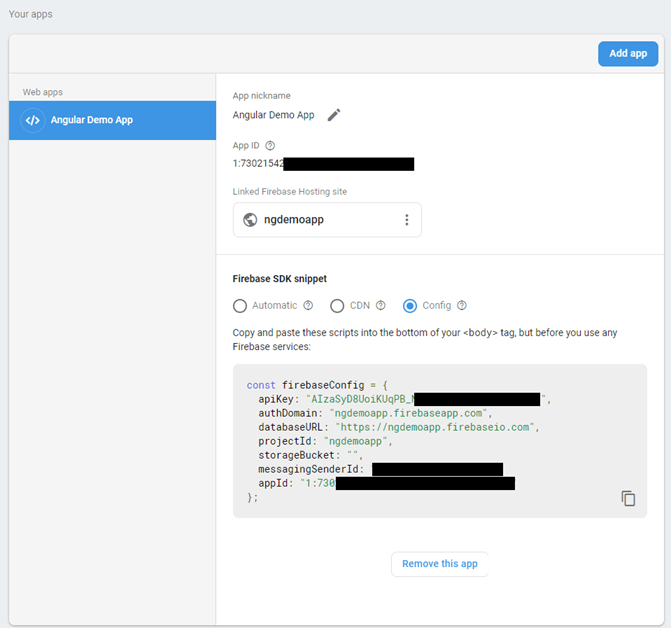

# Device Access & Progressive Web Apps

## HTML APIs

To enable access on Dev Instances of Angular use:

```
ng serve --host 0.0.0.0
```

To check for a device feature like mediaDevices use:

```
const supported = 'mediaDevices' in navigator;
```

### Navigator

Allows replacing Plugins by HTML Standard.

[MDN Navigator Reference](https://developer.mozilla.org/en-US/docs/Web/API/Navigator)

Example Cordova Geolocation Plugin:

```typescript
import { Injectable } from '@angular/core';
import { Observable } from 'rxjs';

declare var navigator;

@Injectable({
  providedIn: 'root'
})
export class GeoServiceHTMLService {
  constructor() {}

  getCurrentPosition(): Observable<any> {
    // Wrapping a callback funtion to Observable
    // navigator.geolocation.getCurrentPosition(success[, error[, [options]])
    return new Observable(observer => {
      navigator.geolocation.getCurrentPosition(position => {
        observer.next(position);
        observer.complete();
      }, observer.error.bind(observer));
    });
  }
}
```

Nice collection of Samples:

[HTLM Apis Collection](https://girliemac.com/presentation-slides/html5-mobile-approach/deviceAPIs.html)

## Cordova

### Cordova Native App

[Cordova Home](https://cordova.apache.org/)

Install Cordova CLI:

```
npm install -g cordova
```

Scaffold project:

```
cordova create PROJECTNAME
```

Add a platform:

```
cordova platform add ios | android | browser | elektron
```

Run a platform

```
cordova run browser | ios | android
```

### Manage Plugins

[Find Plugin using Cordova Plugin Search](https://cordova.apache.org/plugins/)

Add Plugin:

```
cordova plugin add [plugin]
cordova plugin add cordova-device-plugin
cordova plugin add cordova-plugin-camera
```

### Build & Deploy App

- [Enalble Developer Featues on Device](https://developer.android.com/studio/debug/dev-options)

- Build, Deploy & Run App using adb

```
cordova build android | ios --debug
adb install -r platforms\android\app\build\outputs\apk\debug\app-debug.apk
cordiva run android
```

### Configure Debugging

- Browser Based Debugging - open Chrome - Go to:

```
chrome://inspect/#devices
```

[Cordova Debug Tools](https://github.com/Microsoft/vscode-cordova)

### Cordova Simulate

[Cordova Simulate](https://cordova.apache.org/howto/2018/02/02/cordova-simulate.html)

```
npm install -g cordova-simulate
```

### Cordova Wrap Angular

Add Cordova to a new folder

```
cordova create smart-sammler-cordova at.yourdomain.sammler SmartSammler
```

Merge the two projects & and copy Cordova-section to `package.json`

```
 "cordova": {
    "plugins": {
      "cordova-plugin-whitelist": {},
    },
    "platforms": [
      "browser",
      "android",
      "ios"
    ]
  }
}
```

Test on device

```
cordova run ios | android
```

> Note: Make sure you have to `ANDROID_HOME` env. var. set to `C:\Users\%USER%\AppData\Local\Android\Sdk` and downloaded Android Build SDK


## Native Script

[Native Script](https://www.nativescript.org/)

Install Native Script

```
npm install -g nativescript
```

Project Setup

```
tns create nsCamera --ng
cd nsCamera
tns platform add ios
tns platform add android
```

Run Project

```
tns preview
```

## Links & Readings

[Android Device Bridge - Gettings started](https://www.xda-developers.com/install-adb-windows-macos-linux/)

[Chrome Remote Debugging](https://software.intel.com/en-us/xdk/docs/using-remote-chrome-devtools-to-debug-android-cordova-apps)

[Apple Remote Debugging](https://software.intel.com/en-us/xdk/docs/using-web-inspector-remote-to-debug-ios-cordova-apps)

[Cordova Browser Platform Details](https://www.raymondcamden.com/2016/03/22/the-cordova-browser-platform)

## Device Access

## Progressive Web Apps

### Prerequisites: smartSammler REST Api

Requires [.NET Core SDK v2.2.103](https://dotnet.microsoft.com/download/thank-you/dotnet-sdk-2.2.103-windows-x64-installer) and SQL Standard or Enterprise to be installed locally. If you want to use another version change connection string in appsettings.json.

Don't forget to create SQL Login `angular` with pwd `angular` as Sysadmin.

Go to folder where `*.csproj` is located, open console and run:

`dotnet restore` and then  
`dotnet run`

For device testing it might be helpful to enable remote access - by default the .Net Core API is only available using `http://localhost:PORT/` and is not listening to the ip of your dev machine.

`dotnet run --urls http://0.0.0.0:5000` or
`dotnet run --urls https://0.0.0.0:5001`

---

### Setup, Base Scaffolding & Getting started

Allow Chrome to use self signed localhost certs:

```
chrome://flags/#allow-insecure-localhost
```

#### Create Project with Service Worker

```
ng new smartSammlerPWA
cd smartSammlerPWA
ng add @angular/pwa --project smartSammlerPWA
```

Make sure you adjust your `environment.prod` to match IP config of your dev machine

```
export const environment = {
  production: false,
  appName: 'smart Sammler',
  googleApiKey: 'AIzaSyBIhPL-ZRldsuzXJoclj-********-0IeY',
  apiURL: 'https://YOURIP:5000/api/',
  userID: 'user001',
  firebase: {
    apiKey: '*****',
    authDomain: 'ngsmartsammler.firebaseapp.com',
    databaseURL: 'https://:********:.firebaseio.com',
    projectId: 'ngsmartsammler',
    storageBucket: '',
    messagingSenderId: ':********:',
    appId: '1:********:web:6144104923e88db27ab2d8',
    measurementId: 'G-:********:'
  }
};
```

#### Create a prod build

```
ng build --prod [--delete-output-path false]
```

> Note: Make sure your envirenment.prod.ts matches environment.ts

#### Serving Build

To serve the build you need an http-server. Use `angular-http-server` or `http-server`

```
npm install -g angular-http-server
ng build --prod
cd .\dist\smartSammler\
angular-http-server
```

##### Use https://127.0.0.1:8080

[ngrok](https://ngrok.com/) is a tool that provides an `https-secured tunnel` to `localhost` that enables
testing your PWAs. Requires registration but is free.

```
ngrok.exe http 8080
```



### Tools

#### Firebase Hosting

Register [Firebase Project](https://console.firebase.google.com) and add an App

Copy App Configuration to environment:



Install Firebase Tools

```
npm install -g firebase-tools
```

Login to Firebase:

```
firebase login
```

Init Project for Firebase

```
firebase init
```

Publish to Firebase

```
firebase deploy
```

#### Other Tools

[Google Maps Key](https://developers.google.com/maps/documentation/javascript/get-api-key)

[Open Port Detection Tool](https://www.yougetsignal.com/tools/open-ports/)

[Getting Started with Lighthouse](https://developers.google.com/web/tools/lighthouse/)

[Web-Push-Libs](https://github.com/web-push-libs/web-push)

---

### Links & Readings

[manifest.json Reference](https://developers.google.com/web/fundamentals/web-app-manifest/)

[Fine Tuning PWAs](https://medium.com/progressive-web-apps/2018-state-of-progressive-web-apps-f7517d43ba70)

[Turn exisitung Angular App into PWA](https://blog.angular-university.io/angular-service-worker/)

[Debugging Service Workers](https://developers.google.com/web/fundamentals/codelabs/debugging-service-workers/)
