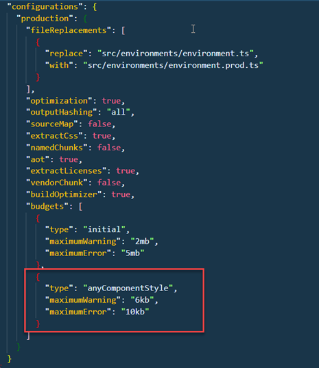

# Angular Elements

Eleven steps to success:

- Create Project:

```
ng new ngSkillsCE
```

- Add Elements:

```
ng add @angular/elements
```

- Add Polyfills:

```
npm install -S @webcomponents/webcomponentsjs @webcomponents/custom-elements
```

- Add the Polyfills to the polyfills.ts

```
import '@webcomponents/custom-elements/src/native-shim';
import '@webcomponents/custom-elements/custom-elements.min';
```

- Add ngx-build-plus

```
ng add ngx-build-plus
```

4. Create your Component: `ng g c skills-list`

5. Add it to AppComponent & Implement your Custom Element

6. Delete AppComponent

7. Modify App Module:

```typescript
@NgModule({
  declarations: [SkillslistComponent],
  imports: [BrowserModule, FormsModule],
  entryComponents: [SkillslistComponent]
})
export class AppModule {
  constructor(private injector: Injector) {}

  ngDoBootstrap() {
    const el = createCustomElement(SkillslistComponent, {
      injector: this.injector
    });

    customElements.define('ngxe-skills', el);
  }
}
```

> Note: Uncomment everything related to app.component.ts

10. Add custom build script to npm scripts:

```
 "elements": "ng build --prod --keep-polyfills --single-bundle  true --output-hashing none"
```

11 Run `npm run elements` and test using the provided `index.html` in the dist folder

> Note: If you receive an err like:
> `Schema validation failed with the following errors: Data path ".budgets[1].type" should be equal ...` modify `angular.json`. Delete the highlighted section

> 

HTML for Testing:

```html
<!DOCTYPE html>
<html lang="en">
  <head>
    <meta charset="utf-8" />
    <title>NgSkillsCE</title>
    <base href="/" />
    <meta name="viewport" content="width=device-width, initial-scale=1" />
    <link rel="icon" type="image/x-icon" href="favicon.ico" />
  </head>
  <body>
    <ngxe-skills></ngxe-skills>
    <script src="polyfills-es5.js" nomodule defer></script
    ><script src="polyfills-es2015.js" type="module"></script
    ><script src="scripts.js" defer></script
    ><script src="main-es2015.js" type="module"></script
    ><script src="main-es5.js" nomodule defer></script>
  </body>
</html>
```

To handle events raised from your web component use this patter in a custom.js

```javascript
document.addEventListener('DOMContentLoaded', function(event) {
  var el = document.querySelector('#ngskills');
  el.addEventListener('onSaveSkills', data =>
    console.log('Logging Save from host', data.detail)
  );
});
```

If you want to create `ONE SINGLE FILE` you can use an older approach to concat the files:

Install `npm install --save-dev concat fs-extra`

Add `elements-build.js` to root folder

```javascript
const fs = require('fs-extra');
const concat = require('concat');

(async function build() {
  const files = [
    './dist/nge-skills/runtime.js',
    './dist/nge-skills/polyfills.js',
    './dist/nge-skills/scripts.js',
    './dist/nge-skills/main.js'
  ];

  await fs.ensureDir('elements');
  await concat(files, 'elements/nge-skills.js');
  await fs.copyFile('./dist/nge-skills/styles.css', 'elements/styles.css');
})();
```

Add to your custom build script in `package.json`:

```
"elements": "ng build --prod --keep-polyfills --single-bundle  true --output-hashing none && node elements-build.js
```

To test your Web Component:

Install a tool that can serve static pages:

```
npm i -g angular-http-server
```

Replace `<app-root></app-root>` in `dist/ngSkillsCE/index.html` with `<ngxe-skills></ngxe-skills>`

In `dist/ngSkillsCE/` run:

```
angular-http-server
```

Navigate to: http://localhost:8080/
