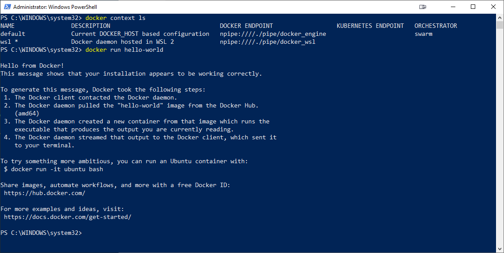
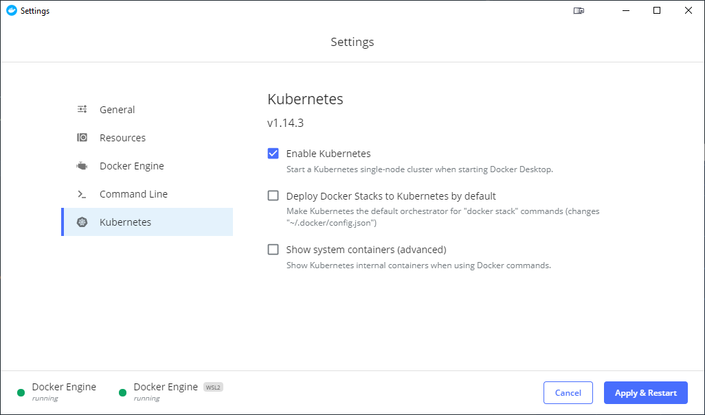
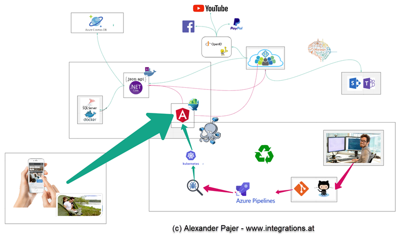

# Advanced Publishing & Hosting

## Publishing

### Firebase

## Deploy to Firebase

```
npm i -g firebase-tools
firebase login
firebase init
firebase deploy
```

## Docker & Kubernetes Basics

### Setup Window Subsystem for Linux - Ubuntu

To check the WSL mode, run:

```
wsl -l -v
```

To upgrade to v2, run:

```
wsl --set-version Ubuntu 2
```

[Windows Subsysstem for Linux](https://docs.microsoft.com/en-us/windows/wsl/install-win10)



> Note: if you have troubles running docker on wsl make sure you installed docker desktop AFTER setting wsl to 2

### Docker

Download an Image

`docker pull microsoft/mssql-server-linux:latest`

### Base Switches & Things to know

Detached: `-d`

Cleanup: `--rm`

Map Ports `LocalPort:DockerPort` : `--p 8080:5000`

Mount Containers to allow Network Communication: `--link sqllinux:sqllinux`

Prefexing prod keeps Intellisense in file and allows you to have more than one Dockerfile. Example:

`Dockerfile` or `anguarui.dockerfile`

---

[Docker for WSL Preview](https://docs.docker.com/docker-for-windows/wsl-tech-preview/)

[Docker CLI Reference](https://docs.docker.com/engine/reference/commandline/cli/)

[Docker Compose Cheatsheet](https://devhints.io/docker-compose)

### Kubernetes



[Kubernetes Base Terms](https://docs.bytemark.co.uk/article/kubernetes-terminology-glossary/)

[Kubectl Commands](https://kubernetes.io/docs/reference/generated/kubectl/kubectl-commands)

### Google Cloud Code

[Cloud Code VS Code Extension](https://marketplace.visualstudio.com/items?itemName=GoogleCloudTools.cloudcode)

[Cloud Code Getting Started](https://cloud.google.com/code/docs/vscode/quickstart)

---

## Containerize a 3-Tier Application

---



### Run SQL for Linux in Container

---

`docker run -d --name sqllinux -e 'ACCEPT_EULA=Y' -e 'SA_PASSWORD=TiTp4SQL@dmin' microsoft/mssql-server-linux:latest`

Show running containers: `docker ps -a`

Kill & Remove Containers

```
docker kill CONTAINERID
docker rm CONTAINERID
```

---

### Containerize .NET Core Web Api - Dockerfile

Specify Dockerfile for Build: -f ... Dockerfile | prod.dockerfile

Adjust Connection String & use it in Startup.cs:

`"DockerConnection": "Data Source=sqllinux;Initial Catalog=VoucherDockerDB;;User ID=sa;Password=TiTp4SQL@dmin"`

```
var conStr = configuration["ConnectionStrings:DockerConnection"];
services.AddEntityFrameworkSqlServer().AddDbContext<SkillDBContext>(options => options.UseSqlServer(conStr));
```

```
docker build --rm -f Dockerfile -t skillsapi:latest .
docker run -d --rm -p 8080:8080 --link sqllinux:sqllinux skillsapi:latest
```

---

### Containerize Angular Frontend

---

[NGINX](https://www.nginx.com/) is a commonly used Web Server to serve static Apps like Angular

Execute in `..\13 Publishing\VouchersUI\`

#### Build & check NGINX - app.nginx.dockerfile

Look at `/config/nginx.conf`

Execute

```
docker build -f app.nginx.dockerfile -t nginxtest .
docker run -d -p 8080:80/tcp nginxtest
```

Check `http://localhost:8080` for result

Attach a shell to the docker container & investigate `/usr/share/nginx/html`

---

#### Create a Production Build - app.prod.dockerfile

---

Build skillsUI image:

`docker build --rm -f "app.prod.dockerfile" -t skillsUI .`

Run skillsUI:

`docker run -p 8080:80 skillsUI`

---

### 3-Tier Farm - docker-compose.yml

```
version: "2.1"

services:
  skillsui:
    image: skillsui
    ports:
      - 8085:80
    networks:
      - skills-network
    depends_on:
      - skillsapi
  skillsapi:
    image: skillsapi
    ports:
      - 8080:5000
    networks:
      - skills-network
    depends_on:
      - sqllinux
  sqllinux:
    image: microsoft/mssql-server-linux
    ports:
      - 1433:1433
    environment:
      ACCEPT_EULA: "Y"
      SA_PASSWORD: "TiTp4SQL@dmin"
    networks:
      - skills-network
networks:
  skills-network:
    driver: bridge


Build your Network:

`docker-compose build`

Run Network

`docker-compose up`

---

#### Run Angular agains NGINX in watch mode - app.dev.dockerfile

On Windows Host the mountend folder needs to be shared on Windows and "Shared Devices" needs to be enabled in Docker Desktop


Build App & keep "dist"-folder when building:

`ng build --watch --delete-output-path false`

Build the dev container:

`docker build --rm -t vouchersdev -f app.dev.dockerfile .`

Run & Map local `dist/vouchersui` folder as `html` to nginx:

Use on Windows:

`docker run -p 8080:80 -v ${PWD}/dist/vouchersui:/usr/share/nginx/html vouchersdev`

Use on Linux / Mac Host

`docker run -p 8080:80 -v $(pwd)/dist/vouchersui:/usr/share/nginx/html vouchersdev`

Be aware that `nginx.conf` contains a route that redirects Server Side `404 errors` to Angular's `index.html` for Angular Routing to detect the route.

```

location / {
try_files $uri $uri/ /index.html =404;
}

```

---
```
